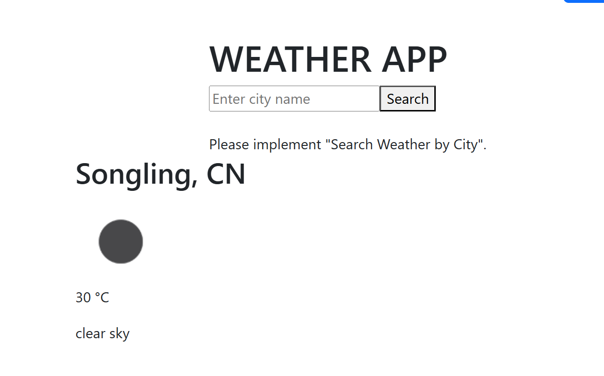
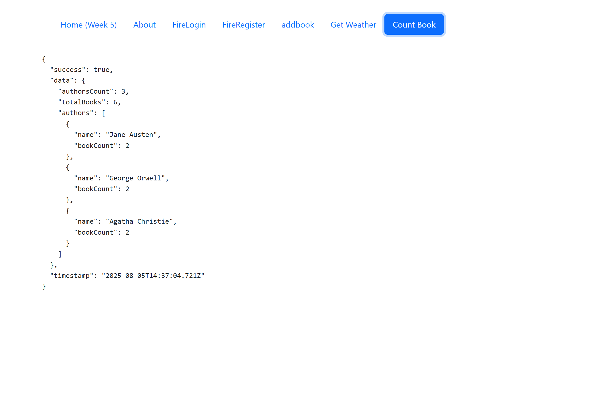
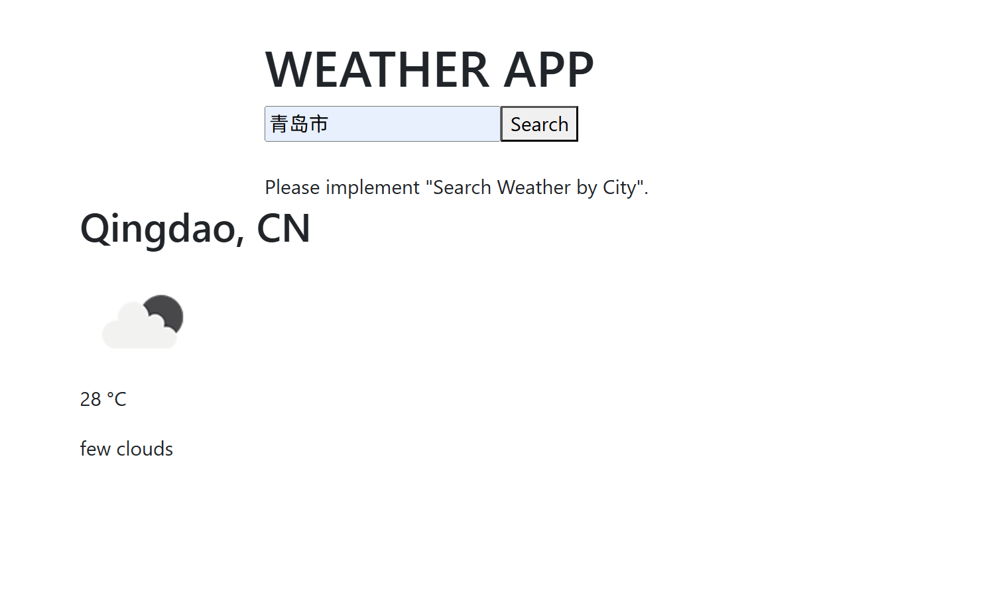
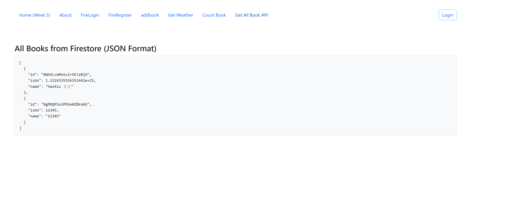

EFOLIO TASK 10.1 (PASS AND CREDIT LEVEL) 

Screenshot set 1: Screenshots of the code and browser showing the current location weather

code:
```html
<template>
    <div class="container">
      <div class="header">
        <h1>WEATHER APP</h1>
        <div class="search-bar">
          <input
            type="text"
            v-model="city"
            placeholder="Enter city name"
            class="search-input"
          />
          <button @click="searchByCity" class="search-button">
            Search
          </button>
          <br />
          <br />
          Please implement "Search Weather by City".
        </div>
      </div>
    </div>
  
    
    <main>
      <div v-if="weatherData">
        <h2>
          {{ weatherData.name }}, {{ weatherData.sys.country }}
        </h2>
        <div>
          
          <p>{{ temperature }} °C</p>
        </div>
        <span>{{ weatherData.weather[0].description }}</span>
      </div>
    </main>
  </template>
  
  <script>
  import axios from "axios";
  
  const apikey = "546def5f849d1aa164c54cf7456ae55d";
  
  export default {
    name: "App",
    data() {
      return {
        city: "",
        weatherData: null,
        hourlyForecast: [],
        dailyForecast: [],
      };
    },
    computed: {
      temperature() {
        return this.weatherData
          ? Math.floor(this.weatherData.main.temp)
          : null;
      },
      iconUrl() {
        return this.weatherData
          ? `https://openweathermap.org/img/wn/${this.weatherData.weather[0].icon}@2x.png`
          : null;
      },
    },
    mounted() {
      this.fetchCurrentLocationWeather();
    },
    methods: {
      async fetchCurrentLocationWeather() {
        if (navigator.geolocation) {
          navigator.geolocation.getCurrentPosition(async (position) => {
            const { latitude, longitude } = position.coords;
            const url = `https://api.openweathermap.org/data/2.5/weather?lat=${latitude}&lon=${longitude}&appid=${apikey}&units=metric`;
            await this.fetchWeatherData(url);
          });
        }
      },
      async searchByCity() {
        if (!this.city) return;
        const url = `https://api.openweathermap.org/data/2.5/weather?q=${this.city}&appid=${apikey}&units=metric`;
        await this.fetchWeatherData(url);
      },
      async fetchWeatherData(url) {
        try {
          const response = await axios.get(url);
          this.weatherData = response.data;
        } catch (error) {
          console.error("Error fetching weather data:", error);
        }
      },
    },
  };
  </script>
```
Screenshot set 2: Screenshots of the code and browser in API page showing the number of authors and books.

code:
```html
<template>
    <div v-if="apiResponse" class="api-response">
      <pre>{{ JSON.stringify(apiResponse, null, 2) }}</pre>
    </div>
</template>

<script setup>
import { ref, onMounted } from 'vue'

const authors = ref([])
const loading = ref(false)
const error = ref(null)
const apiResponse = ref(null)

const authorsCount = ref(0)
const totalBooks = ref(0)

const calculateStats = () => {
  authorsCount.value = authors.value.length
  totalBooks.value = authors.value.reduce((total, author) => {
    return total + author.famousWorks.length
  }, 0)
}


const getApiData = async () => {
    loading.value = true
  error.value = null
  
  try {
    const response = await fetch('src/assets/json/authors.json')
    
    if (!response.ok) {
      throw new Error(`HTTP error! status: ${response.status}`)
    }
    
    const data = await response.json()
    authors.value = data
    
    calculateStats()
    
  } catch (err) {
    error.value = `Error loading authors data: ${err.message}`
    console.error('Error loading authors data:', err)
  } finally {
    loading.value = false
  };

  apiResponse.value = {
    success: true,
    data: {
      authorsCount: authorsCount.value,
      totalBooks: totalBooks.value,
      authors: authors.value.map(author => ({
        name: author.name,
        bookCount: author.famousWorks.length,
      }))
    },
    timestamp: new Date().toISOString()
  }
}

onMounted(() => {
  getApiData();
})

defineExpose({
  getApiData
})
</script>

```

EVALUATION CRITERIA: 
All activities are completed properly. The screenshot resolution is clear. 

EFOLIO TASK 10.2 (DISTINCTION AND HIGH DISTINCTION LEVEL) 

Screenshot set 1: Screenshots of your code and browser screen demonstrating you can search weather by city, for example, type "Clayton, AU" and it will show Clayton's weather and temperature in Celsius with a corresponding icon of the weather 



Screenshot set 2: Screenshots of your code and browser screen demonstrating you can show all books in JSON format when navigating to a page called "GetAllBookAPI"


code:
```html
<template>
  <div class="container mt-4">
    <h3>All Books from Firestore (JSON Format)</h3>
    <div v-if="error" class="alert alert-danger">{{ error }}</div>
    <div v-if="isLoading" class="d-flex align-items-center">
      <strong>Loading...</strong>
      <div class="spinner-border ms-auto" role="status" aria-hidden="true"></div>
    </div>
    <pre v-else class="code-block">{{ booksJson }}</pre>
  </div>
</template>

<script setup>
import { ref, onMounted, computed } from 'vue';
import { getFirestore, collection, getDocs } from "firebase/firestore";

const books = ref([]);
const isLoading = ref(true);
const error = ref(null);

// 使用计算属性将书籍数据格式化为美观的JSON字符串
const booksJson = computed(() => {
  return JSON.stringify(books.value, null, 2);
});

// 在组件挂载后从Firestore获取数据
onMounted(async () => {
  try {
    const db = getFirestore();
    const querySnapshot = await getDocs(collection(db, "books"));
    const booksData = [];
    querySnapshot.forEach((doc) => {
      booksData.push({ id: doc.id, ...doc.data() });
    });
    books.value = booksData;
    error.value = null;
  } catch (err) {
    console.error("Error fetching documents: ", err);
    error.value = "Failed to fetch books from Firestore.";
  } finally {
    isLoading.value = false;
  }
});
</script>

<style scoped>
.code-block {
  background-color: #f8f9fa;
  border: 1px solid #dee2e6;
  border-radius: .25rem;
  padding: 1rem;
  white-space: pre-wrap;
  word-wrap: break-word;
}
</style>
```