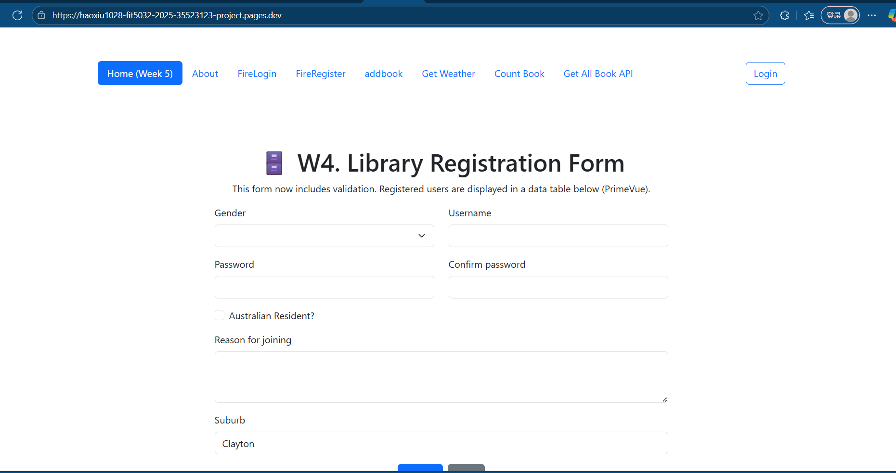
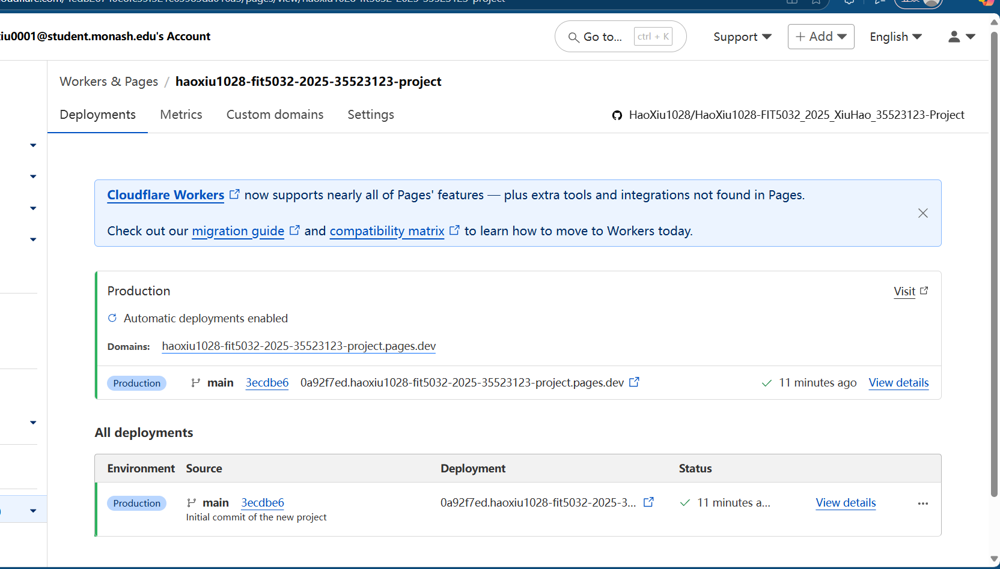

### EFOLIO TASK 5.1
#### Screenshot 1

#### Screenshot 2:





### EFOLIO TASK 5.2
#### router/index.js

#### src/App.vue

#### src/views/HomeView.vue
```html
<script setup>
import { ref } from 'vue'
import DataTable from 'primevue/datatable'
import Column from 'primevue/column'

const formData = ref({
  username: '',
  password: '',
  comfirmPassword: '',
  isAustralian: false,
  reason: '',
  gender: '',
  suburb: 'Clayton'
})


const errors = ref({
  username: null,
  password: null,
  confirmPassword: null,
  resident: null,
  gender: null,
  reason: null
})


const submittedCards = ref([])


const validateConfirmPassword = (blur) => {
  if (formData.value.password !== formData.value.confirmPassword) {
    if (blur) errors.value.confirmPassword = 'Passwords do not match.'
  } else {
    errors.value.confirmPassword = null
  }
}

const validateName = (blur) => {
  if (formData.value.username.length < 3) {
    if (blur) errors.value.username = 'Name must be at least 3 characters'
  } else {
    errors.value.username = null
  }
}

const validatePassword = (blur) => {
  const password = formData.value.password
  const minLength = 8
  const hasUppercase = /[A-Z]/.test(password)
  const hasLowercase = /[a-z]/.test(password)
  const hasNumber = /\d/.test(password)
  const hasSpecialChar = /[!@#$%^&*(),.?":{}|<>]/.test(password)

  if (password.length < minLength) {
    if (blur) errors.value.password = `Password must be at least ${minLength} characters long.`
  } else if (!hasUppercase) {
    if (blur) errors.value.password = 'Password must contain at least one uppercase letter.'
  } else if (!hasLowercase) {
    if (blur) errors.value.password = 'Password must contain at least one lowercase letter.'
  } else if (!hasNumber) {
    if (blur) errors.value.password = 'Password must contain at least one number.'
  } else if (!hasSpecialChar) {
    if (blur) errors.value.password = 'Password must contain at least one special character.'
  } else {
    errors.value.password = null
  }
}


const validateReason = (blur) => {
  const reason = formData.value.reason.trim()

  if (reason.length < 10) {
    if (blur) errors.value.reason = 'Please enter a reason of at least 10 characters.'
    return
  }
  if (reason.toLowerCase().includes('friend')) {
    errors.value.reason = null
  } else {
    if (blur) errors.value.reason = null
  }
}


 
const submitForm = () => {
  validateName(true)
  validatePassword(true)
  validateConfirmPassword(true)
  
  if (!errors.value.username && !errors.value.password && !errors.value.confirmPassword) {
    submittedCards.value.push({ ...formData.value })
    clearForm()
  }
}


const clearForm = () => {
  formData.value = {
    username: '',
    password: '',
    comfirmPassword: '',
    isAustralian: false,
    reason: '',
    gender: ''
  }
}
</script>

<template>
  <!-- 🗄️ W4. Library Registration Form -->
  <div class="container mt-5">
    <div class="row">
      <div class="col-md-8 offset-md-2">
        <h1 class="text-center">🗄️ W4. Library Registration Form</h1>
        <p class="text-center">
          This form now includes validation. Registered users are displayed in a data table below
          (PrimeVue).
        </p>
        <form @submit.prevent="submitForm">
          <div class="row mb-3">
            <div class="col-md-6 col-sm-6">
              <label for="gender" class="form-label">Gender</label>
              <select class="form-select" id="gender" v-model="formData.gender" required>
                <option value="male">Male</option>
                <option value="female">Female</option>
                <option value="other">Other</option>
              </select>
            </div>
            <div class="col-md-6 col-sm-6">
              <label for="username" class="form-label">Username</label>
              <input type="text" class="form-control" id="username" 
                @blur="() => validateName(true)"
                @input="() => validateName(false)" 
                v-model="formData.username" />
              <div v-if="errors.username" class="text-danger">{{ errors.username }}</div>
            </div>
          </div>

          <div class="row mb-3">
            <div class="col-md-6 col-sm-6">
              <label for="password" class="form-label">Password</label>
              <input type="password" class="form-control" id="password" 
                @blur="() => validatePassword(true)"
                @input="() => validatePassword(false)" 
                v-model="formData.password" />
              <div v-if="errors.password" class="text-danger">{{ errors.password }}</div>
            </div>
            <div class="col-md-6 col-sm-6">
              <label for="confirm-password" class="form-label">Confirm password</label>
              <input type="password" class="form-control" id="confirm-password" 
                v-model="formData.confirmPassword"
                @blur="() => validateConfirmPassword(true)" />
              <div v-if="errors.confirmPassword" class="text-danger">{{ errors.confirmPassword }}</div>
            </div>
          </div>

          <div class="col-md-6 col-sm-6 mb-3">
            <div class="form-check">
              <input type="checkbox" class="form-check-input" id="isAustralian" 
                v-model="formData.isAustralian" />
              <label class="form-check-label" for="isAustralian">Australian Resident?</label>
            </div>
          </div>

          <div class="mb-3">
            <label for="reason" class="form-label">Reason for joining</label>
            <textarea class="form-control" id="reason" rows="3" 
              v-model="formData.reason"
              @blur="() => validateReason(true)"
              @input="() => validateReason(false)"></textarea>
            <div v-if="errors.reason" class="text-danger">{{ errors.reason }}</div>
            <div v-else-if="formData.reason.toLowerCase().includes('friend')" class="text-success">
              Great to have a friend.
            </div>
          </div>

          <div class="mb-3">
            <label for="suburb" class="form-label">Suburb</label>
            <input type="text" class="form-control" id="suburb" 
              v-bind:value="formData.suburb" />
          </div>

          <div class="text-center">
            <button type="submit" class="btn btn-primary me-2">Submit</button>
            <button type="button" class="btn btn-secondary" @click="clearForm">Clear</button>
          </div>
        </form>
      </div>
    </div>
  </div>

  <div class="row mt-5">
    <h4>This is a Primevue Datatable.</h4>
    <DataTable :value="submittedCards" tableStyle="min-width: 50rem">
      <Column field="username" header="Username"></Column>
      <Column field="password" header="Password"></Column>
      <Column field="isAustralian" header="Australian Resident"></Column>
      <Column field="gender" header="Gender"></Column>
      <Column field="reason" header="Reason"></Column>
    </DataTable>
  </div>

  <div class="row mt-5" v-if="submittedCards.length">
    <div class="d-flex flex-wrap justify-content-start">
      <div v-for="(card, index) in submittedCards" :key="index" class="card m-2" style="width: 18rem">
        <div class="card-header">User Information</div>
        <ul class="list-group list-group-flush">
          <li class="list-group-item">Username: {{ card.username }}</li>
          <li class="list-group-item">Password: {{ card.password }}</li>
          <li class="list-group-item">
            Australian Resident: {{ card.isAustralian ? 'Yes' : 'No' }}
          </li>
          <li class="list-group-item">Gender: {{ card.gender }}</li>
          <li class="list-group-item">Reason: {{ card.reason }}</li>
        </ul>
      </div>
    </div>
  </div>
</template>

<style scoped>
.container {
  font-family: 'Segoe UI', Tahoma, Geneva, Verdana, sans-serif;
  max-width: 80vw;
  margin: 0 auto;
  padding: 20px;
  border-radius: 10px;
}

.card {
  border: 1px solid #ccc;
  border-radius: 10px;
  box-shadow: 0 2px 4px rgba(0, 0, 0, 0.1);
}

.card-header {
  background-color: #275fda;
  color: white;
  padding: 10px;
  border-radius: 10px 10px 0 0;
}

.list-group-item {
  padding: 10px;
}

@media (max-width: 768px) {
  .form-control {
    font-size: 0.9rem;
  }
}
</style>
```

#### Screenshot of App in Localhost (browser) open on Home page

#### Screenshot of App in Localhost (browser) open on About page

#### Screenshots of Custom Routing
