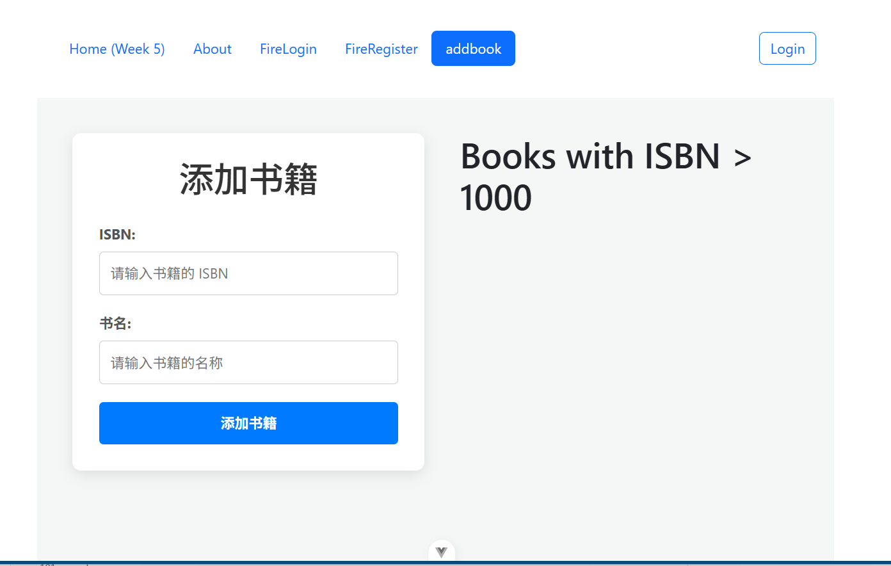
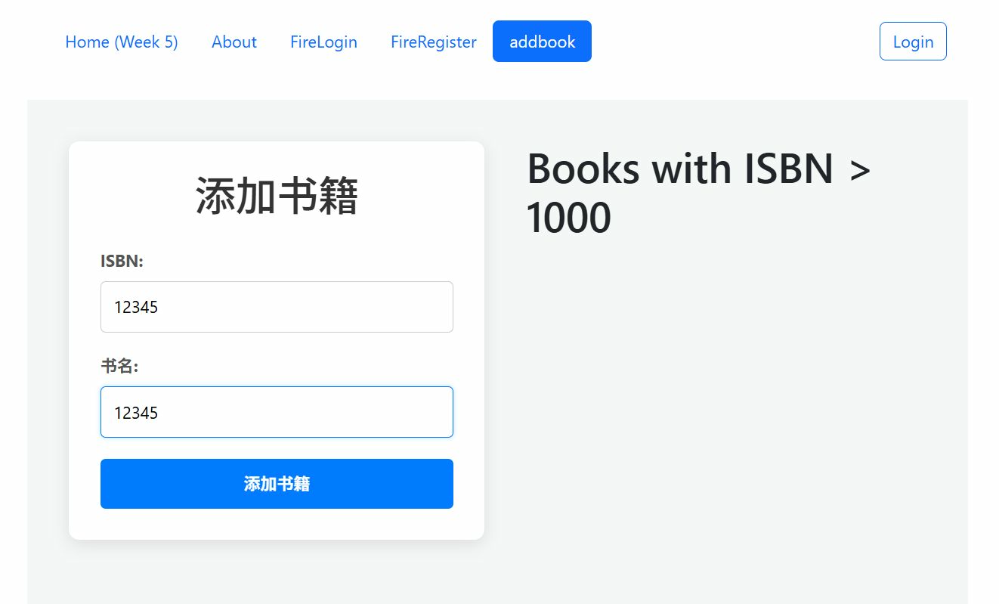
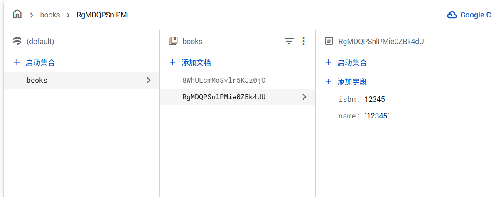
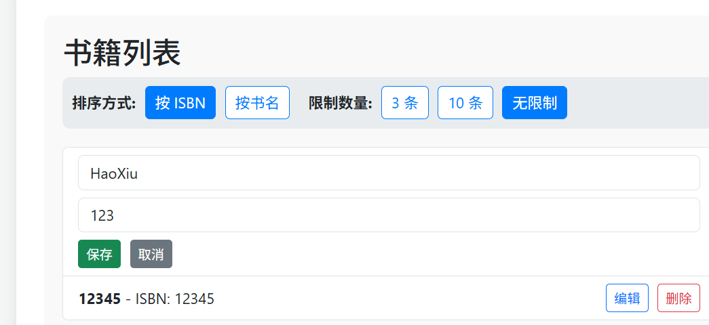
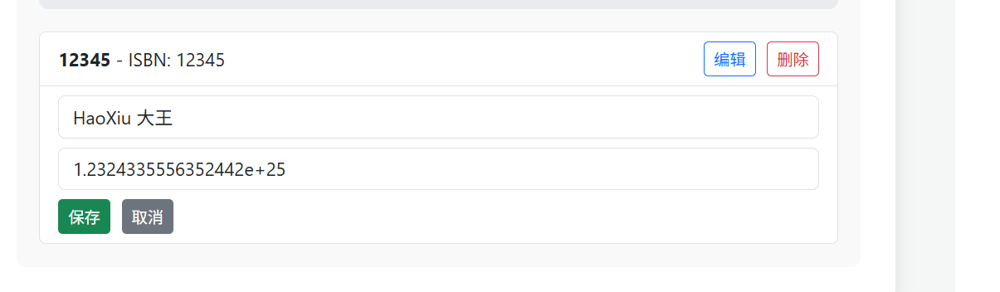
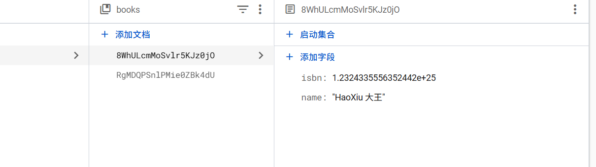
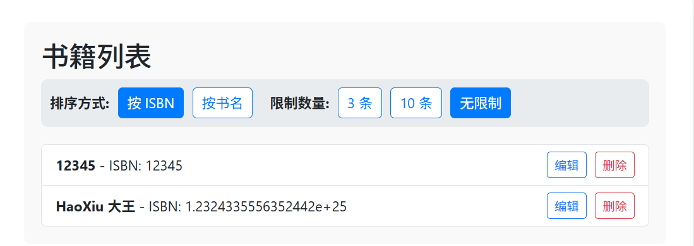

### EFOLIO TASK 8.1 (PASS AND CREDIT LEVEL) 

#### Screenshot set 1: Screenshots of the AddBook page on the browser and Visual Studio code



AddBook code:
```html
<template>
    <div class="add-book-container">
        <div class="form-wrapper">
            <h1>添加书籍</h1>
            <form @submit.prevent="addBook">
                <div class="form-group">
                    <label for="isbn">ISBN:</label>
                    <input type="text" v-model="isbn" id="isbn" required placeholder="请输入书籍的 ISBN" />
                </div>
                <div class="form-group">
                    <label for="name">书名:</label>
                    <input type="text" v-model="name" id="name" required placeholder="请输入书籍的名称" />
                </div>
                <button type="submit" class="submit-btn">添加书籍</button>
            </form>
        </div>
        <div class="book-list-wrapper">
          <BookList />
        </div>
    </div>
</template>

<script>
import { ref } from 'vue';
import db from '../firebase/init.js';
import { collection, addDoc } from 'firebase/firestore';

import BookList from '../components/BookList.vue';

export default {
    components: {
        BookList
    },
    setup() {
        const isbn = ref('');
        const name = ref('');

        const addBook = async () => {
            if (!isbn.value || !name.value) {
                alert('ISBN 和书名不能为空');
                return;
            }

            try {
                const isbnNumber = Number(isbn.value);
                if (isNaN(isbnNumber)) {
                    alert('ISBN 必须是一个有效的数字');
                    return;
                }

                await addDoc(collection(db, 'books'), {
                    isbn: isbnNumber,
                    name: name.value
                });

                isbn.value = '';
                name.value = '';
                alert('书籍添加成功！');
            } catch (error) {
                console.error('添加书籍时出错: ', error);
                alert('添加书籍失败，请查看控制台获取更多信息。');
            }
        };
        
        return {
            isbn,
            name,
            addBook
        };
    }
};
</script>

<style scoped>
.add-book-container {
    display: flex;
    justify-content: center;
    align-items: flex-start;
    padding: 40px;
    gap: 40px; /* 在表单和列表之间添加一些间距 */
    background-color: #f4f7f6;
    min-height: 100vh;
}

.form-wrapper {
    max-width: 400px;
    width: 100%;
    padding: 30px;
    background-color: #ffffff;
    border-radius: 10px;
    box-shadow: 0 4px 15px rgba(0, 0, 0, 0.1);
    transition: all 0.3s ease-in-out;
}

.form-wrapper:hover {
    box-shadow: 0 6px 20px rgba(0, 0, 0, 0.15);
}

.book-list-wrapper {
    max-width: 500px;
    width: 100%;
}

h1 {
    text-align: center;
    color: #333;
    margin-bottom: 25px;
    font-family: 'Arial', sans-serif;
}

.form-group {
    margin-bottom: 20px;
}

label {
    display: block;
    margin-bottom: 8px;
    font-weight: bold;
    color: #555;
}

input[type="text"] {
    width: 100%;
    padding: 12px;
    border: 1px solid #ccc;
    border-radius: 5px;
    box-sizing: border-box; /* 确保 padding 不会影响宽度 */
    transition: border-color 0.3s;
}

input[type="text"]:focus {
    border-color: #007bff;
    outline: none;
    box-shadow: 0 0 5px rgba(0, 123, 255, 0.25);
}

.submit-btn {
    width: 100%;
    padding: 12px;
    background-color: #007bff;
    color: white;
    border: none;
    border-radius: 5px;
    cursor: pointer;
    font-size: 16px;
    font-weight: bold;
    transition: background-color 0.3s ease, transform 0.2s ease;
}

.submit-btn:hover {
    background-color: #0056b3;
    transform: translateY(-2px);
}

.submit-btn:active {
    transform: translateY(0);
}
</style>
```
#### Screenshot set 2: Screenshots of the Firestore page that contains newly added data




### EFOLIO TASK 8.2 (DISTINCTION AND HIGH DISTINCTION LEVEL) 

#### Screenshot set 1: Screenshots of browser and visual studio code that indicates you can update and delete the data from Firestore






#### Screenshot set 2: Screenshots of browser and visual studio code that indicates you can retrieve the database using ,  and , there are no restrictions of how many queries you need to use to do so. whereorderbylimit



BooKList code 
```html

<template>
    <div class="book-list-container">
      <h2>书籍列表</h2>
  
      <!-- 查询控制 -->
      <div class="query-controls">
        <div class="control-group">
          <strong>排序方式:</strong>
          <button @click="setSortBy('isbn')" :class="{ active: sortBy === 'isbn' }">按 ISBN</button>
          <button @click="setSortBy('name')" :class="{ active: sortBy === 'name' }">按书名</button>
        </div>
        <div class="control-group">
          <strong>限制数量:</strong>
          <button @click="setLimit(3)" :class="{ active: limitCount === 3 }">3 条</button>
          <button @click="setLimit(10)" :class="{ active: limitCount === 10 }">10 条</button>
          <button @click="setLimit(0)" :class="{ active: !limitCount }">无限制</button>
        </div>
      </div>
  
      <!-- 加载与错误提示 -->
      <div v-if="loading" class="loading-state">正在加载书籍...</div>
      <div v-if="error" class="error-state">{{ error }}</div>
      
      <!-- 书籍列表 -->
      <ul v-if="books.length" class="list-group">
        <li v-for="book in books" :key="book.id" class="list-group-item">
          <div v-if="editingBookId !== book.id" class="book-display">
            <span>
              <strong>{{ book.name }}</strong> - ISBN: {{ book.isbn }}
            </span>
            <div class="book-actions">
              <button class="btn btn-sm btn-outline-primary" @click="startEditing(book)">编辑</button>
              <button class="btn btn-sm btn-outline-danger" @click="deleteBook(book.id)">删除</button>
            </div>
          </div>
  
          <!-- 编辑表单 -->
          <div v-else class="book-edit">
            <input type="text" v-model="editForm.name" class="form-control mb-2" placeholder="书名">
            <input type="number" v-model="editForm.isbn" class="form-control mb-2" placeholder="ISBN">
            <div class="edit-actions">
              <button class="btn btn-sm btn-success" @click="saveChanges(book.id)">保存</button>
              <button class="btn btn-sm btn-secondary" @click="cancelEditing">取消</button>
            </div>
          </div>
        </li>
      </ul>
      <div v-else-if="!loading" class="no-books">
        没有找到符合条件的书籍。
      </div>
    </div>
  </template>
  
  <script setup>
  import { ref, watch, reactive } from 'vue';
  import db from '../firebase/init.js';
  import { collection, query, where, orderBy, limit, onSnapshot, doc, deleteDoc, updateDoc } from 'firebase/firestore';
  
  // 响应式状态
  const books = ref([]);
  const loading = ref(true);
  const error = ref(null);
  const sortBy = ref('isbn'); // 默认排序字段
  const limitCount = ref(0); // 0 表示无限制
  
  const editingBookId = ref(null);
  const editForm = reactive({ name: '', isbn: '' });
  
  let unsubscribe = null; // 用于存储 onSnapshot 的取消订阅函数
  
  // 构建查询并监听
  const setupSubscription = () => {
    loading.value = true;
    error.value = null;
  
    // 如果已有监听，先取消
    if (unsubscribe) {
      unsubscribe();
    }
  
    try {
      const booksCollection = collection(db, 'books');
      
      // 构建动态查询
      let q = query(
        booksCollection,
        where("isbn", ">", 0), // 一个基础的 where 查询
        orderBy(sortBy.value, 'asc') // 根据 sortBy 的值动态排序
      );
  
      // 如果设置了 limit, 添加到查询中
      if (limitCount.value > 0) {
        q = query(q, limit(limitCount.value));
      }
  
      // 设置实时监听
      unsubscribe = onSnapshot(q, (snapshot) => {
        books.value = snapshot.docs.map(doc => ({ id: doc.id, ...doc.data() }));
        loading.value = false;
      }, (err) => {
        console.error("Firebase Snapshot Error:", err);
        error.value = "无法加载书籍列表。";
        loading.value = false;
      });
  
    } catch (err) {
      console.error("Error setting up subscription:", err);
      error.value = "查询时发生错误。";
      loading.value = false;
    }
  };
  
  // --- 控制函数 ---
  const setSortBy = (field) => {
    sortBy.value = field;
  };
  
  const setLimit = (num) => {
    limitCount.value = num;
  };
  
  // 监听排序或限制的改变，并重新设置监听
  watch([sortBy, limitCount], setupSubscription, { immediate: true });
  
  
  // --- CRUD 操作 ---
  
  // 删除书籍
  const deleteBook = async (id) => {
    if (confirm('确定要删除这本书吗？')) {
      try {
        await deleteDoc(doc(db, 'books', id));
        // onSnapshot 会自动更新UI
      } catch (err) {
        console.error("Error deleting book:", err);
        alert('删除失败！');
      }
    }
  };
  
  // 开始编辑
  const startEditing = (book) => {
    editingBookId.value = book.id;
    editForm.name = book.name;
    editForm.isbn = book.isbn;
  };
  
  // 取消编辑
  const cancelEditing = () => {
    editingBookId.value = null;
  };
  
  // 保存更改
  const saveChanges = async (id) => {
    if (!editForm.name || !editForm.isbn) {
      alert("书名和 ISBN 不能为空。");
      return;
    }
    try {
      const bookRef = doc(db, 'books', id);
      await updateDoc(bookRef, {
        name: editForm.name,
        isbn: Number(editForm.isbn)
      });
      cancelEditing(); // 退出编辑模式
    } catch (err) {
      console.error("Error updating book:", err);
      alert('更新失败！');
    }
  };
  
  </script>
  
  <style scoped>
  .book-list-container {
    padding: 20px;
    background-color: #f9f9f9;
    border-radius: 8px;
  }
  .query-controls {
    display: flex;
    gap: 20px;
    margin-bottom: 20px;
    padding: 10px;
    background-color: #e9ecef;
    border-radius: 8px;
    flex-wrap: wrap;
  }
  .control-group {
    display: flex;
    align-items: center;
    gap: 10px;
  }
  .query-controls button {
    border: 1px solid #007bff;
    background-color: white;
    color: #007bff;
    border-radius: 5px;
    padding: 5px 10px;
    cursor: pointer;
  }
  .query-controls button.active {
    background-color: #007bff;
    color: white;
  }
  .list-group-item {
    display: flex;
    flex-direction: column;
  }
  .book-display, .book-edit {
    width: 100%;
  }
  .book-display {
    display: flex;
    justify-content: space-between;
    align-items: center;
  }
  .book-actions, .edit-actions {
    display: flex;
    gap: 10px;
  }
  .loading-state, .error-state, .no-books {
    text-align: center;
    padding: 20px;
    color: #6c757d;
  }
  .error-state {
    color: #dc3545;
  }
  </style>
```